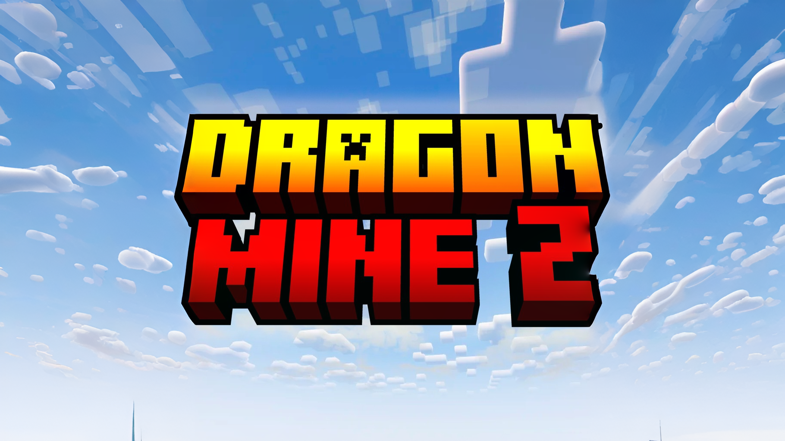

# DragonMine Z 🌟

  

## About

DragonMine Z es un mod de [Minecraft](https://www.minecraft.net/en-us) basado
en [Dragon Ball](https://en.dragon-ball-official.com/) y desarrollado en la versión **1.20.1**.

### Contribuciones

Te gustaría ayudar? ¡Genial! Revisa la [guía de contribución](CONTRIBUTING.md)
para empezar.
(Está en inglés, pero puedes traducirla con
[Google Translate](https://translate.google.com/) o usar algo similar).

### 🌍 Translations

- [Instructions in English](./README.md)

## 🚀 Características

- **Sagas**: Revive las sagas de Dragon Ball Z y Super.
- **Transformaciones**: Transfórmate en Super Saiyan, Super Saiyan Blue, Ultra Instinct y más.
- **Habilidades**: Aprende habilidades como el Kamehameha, Genkidama y más.
- **Misiones**: Completa misiones para obtener recompensas.
- **NPCs**: Interactúa con personajes de la serie.
- **Mundos**: Explora el mundo de Dragon Ball.
- **Items**: Encuentra objetos únicos y poderosos.
- **Personalización**: Crea tu propio personaje y personalízalo!

## 🎯 Uso de Terceros

### Sonidos

Algunos sonidos se usan desde la página de [Zapsplat](https://www.zapsplat.com/) y
de [Freesound](https://freesound.org/):

- [Dragon Ball Scouter/Rastreador Remade.wav](https://freesound.org/s/518004/)
  por Pablobd -- Licencia: Attribution 3.0
- [A Symphony for Akira Toriyama](https://www.youtube.com/watch?v=xNVEkSerkU0)
  por GLADIUS -- Licencia: CC-BY License

## ✨ Autores

### Desarrolladores

- [Yuseix](https://github.com/yuseix300) | *Programador y Líder del Proyecto*
- [ezShokkoh](https://github.com/Shokkoh) | *Programador*
- [Bruno](https://github.com/Bruneitor123) | *Programador & SFX*

### Contribuidores

- [Bati2ra](https://github.com/Bati2ra) | *Programador*

## Licencia

2024, DragonMine Z 4.0 DEED Attribution-NonCommercial-NoDerivs 4.0 International\
[CC BY-NC-ND 4.0](https://creativecommons.org/licenses/by-nc-nd/4.0/deed.en)
